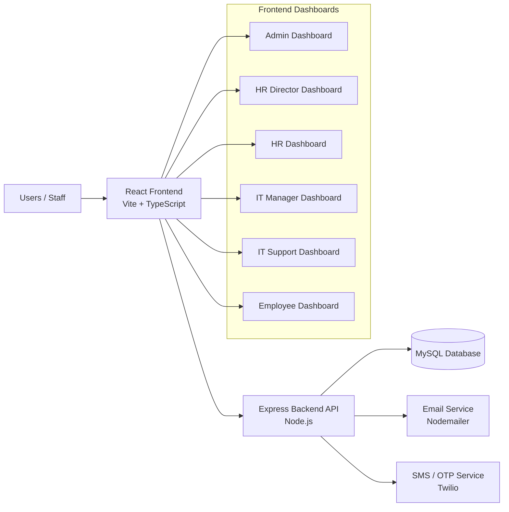
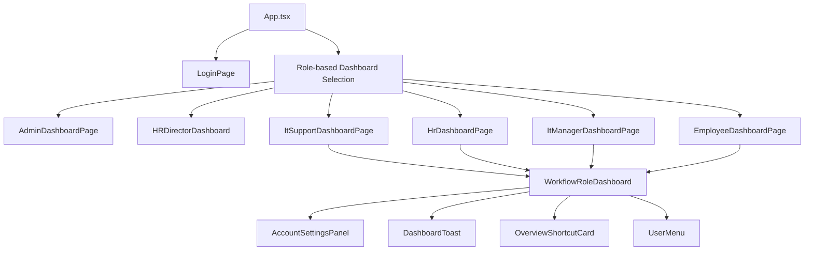
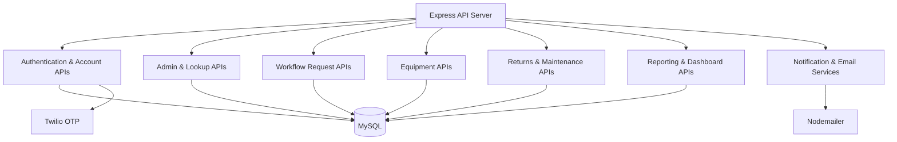
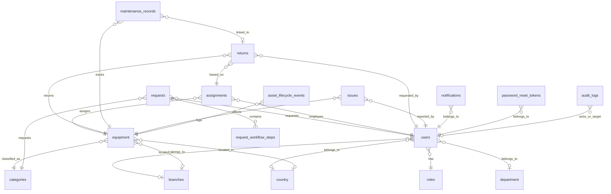
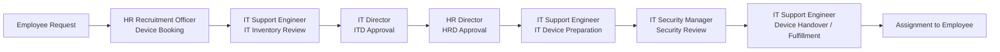
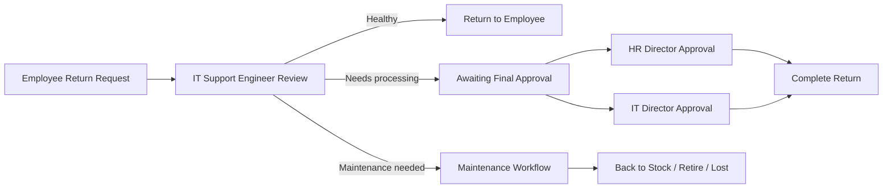
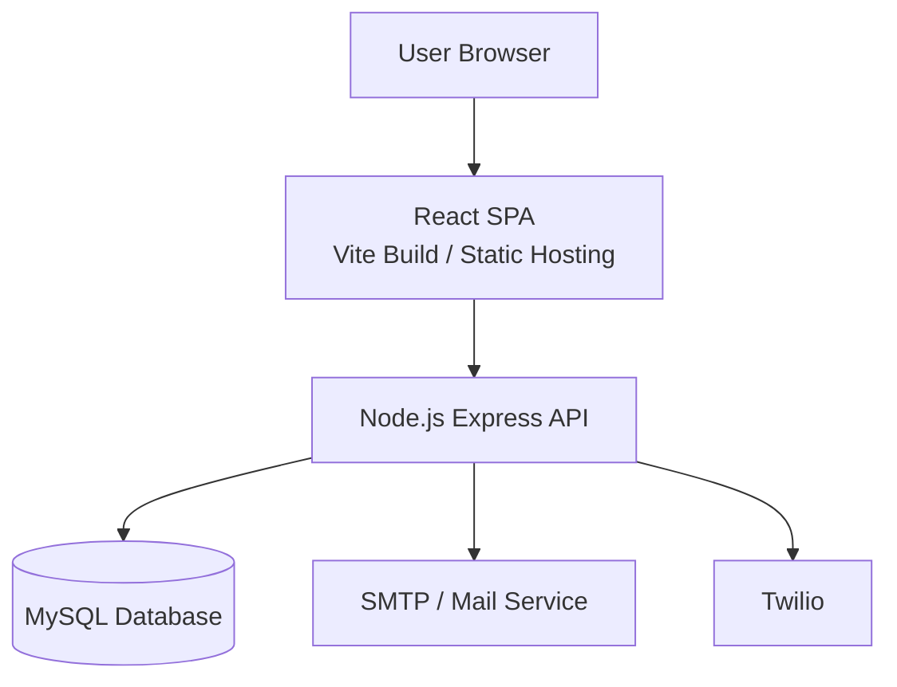

# Airtel Global IMS System Architecture

## 1. Overview

The Airtel Global IMS is a role-based inventory and equipment lifecycle management system used to:

- manage users, roles, branches, departments, and permissions
- register and track equipment assets
- process employee equipment requests through a multi-step approval workflow
- assign, return, inspect, maintain, and retire devices
- provide operational dashboards for different business roles

The solution uses a React + Vite frontend, an Express.js backend API, and a MySQL database.

## 2. High-Level Architecture

## 3. Technology Stack

### Frontend

- React 19
- TypeScript
- Vite
- Lucide React icons
- QRCode library for equipment QR generation

### Backend

- Node.js
- Express 5
- mysql2
- Nodemailer
- Twilio
- dotenv
- CORS

### Database

- MySQL

## 4. Frontend Architecture

The frontend is a single-page application with role-based dashboard routing.

### Core frontend layers

### Frontend responsibilities

- route users to the correct dashboard based on role
- store session user data in local storage
- render role-based sections and actions
- call backend APIs for authentication, approvals, equipment, returns, and reports
- display workflow progress and request history
- generate equipment QR previews

### Current routing notes

- there is no longer a Super User dashboard
- there is no separate IT Security dashboard implementation yet
- `IT security manager` currently routes to the shared IT Support dashboard flow
- visible dashboard UI now emphasizes branch-level location instead of showing country everywhere

## 5. Backend Architecture

The backend is a centralized API service in `backend/server.js`.

### Core backend modules by responsibility

### Major backend API domains

- `/api/auth/*`
  - login
  - OTP verification
  - password reset
  - Microsoft auth integration
- `/api/account/*`
  - profile update
  - password change
- `/api/admin/*`
  - users
  - lookups
  - reports
  - audit logs
  - system controls
- `/api/workflow/dashboard`
  - workflow dashboard data aggregation
- `/api/requests/*`
  - create request
  - approve / reject request
  - update / delete request
  - fulfillment status
  - fulfill request
- `/api/equipment/*`
  - create, update, delete, list equipment
- `/api/returns/*`
  - request return
  - IT review
  - final approve
  - intake processing
- `/api/maintenance/*`
  - complete maintenance
- `/api/issues/*`
  - create, update, delete issue

## 6. Database Architecture

The MySQL database stores organizational structure, users, equipment, workflow records, and lifecycle operations.

### Main entities

### Key tables

- `users`
- `roles`
- `permission`
- `country`
- `branches`
- `department`
- `categories`
- `equipment`
- `requests`
- `request_workflow_steps`
- `assignments`
- `returns`
- `maintenance_records`
- `issues`
- `notifications`
- `asset_lifecycle_events`
- `password_reset_tokens`
- `system_settings`
- `audit_logs`

### Data model note

Country relationships still exist in the database and backend for organizational structure and legacy workflow data, but current dashboard UI is being simplified to focus more on branch-level presentation.

## 7. Role-Based Dashboard Architecture

The system uses role-aware routing and dashboard segmentation.

### Main roles in the current system

- Admin
- HR DIRECTOR
- HR Recruitment officer
- Hr department
- IT Director
- IT Support engineer
- IT security manager
- IT officer
- IT infrastructure manager
- Employee

### Role-to-dashboard mapping

| Role | Dashboard |
|---|---|
| Admin | Admin Dashboard |
| HR DIRECTOR | HR Director Dashboard |
| HR Recruitment officer / Hr department | HR Dashboard |
| IT Director / IT infrastructure manager | IT Manager Dashboard |
| IT Support engineer / IT officer / IT security manager | IT Support Dashboard |
| Employee | Employee Dashboard |

### Current dashboard behavior

- Admin handles master data, user administration, reports, controls, and audit visibility
- HR dashboards handle workforce-related request approvals and user setup
- IT Manager handles higher-level technical approvals and return approval stages
- IT Support handles inventory operations, fulfillment, stock registration, returns intake, and operational request flow
- IT Security does not yet have a dedicated dashboard and currently shares the IT Support dashboard path

## 8. Request Workflow Architecture

The request workflow is configurable and stored in `request_workflow_steps`.

### Default request workflow

### Workflow characteristics

- each request creates multiple workflow step records
- only the current pending role can approve or reject the active step
- each approval updates:
  - workflow step status
  - request status
  - next approver notification
- rejection closes the request and stores the rejection note
- fulfillment assigns a matching equipment asset to the employee

## 9. Return Workflow Architecture

The returns process is separate from the request workflow.

### Return workflow responsibilities

- employee initiates return
- IT Support reviews device condition
- HR Director and IT Director perform final approval where needed
- system updates equipment status and assignment state
- lifecycle events and notifications are recorded

## 10. Reporting Architecture

Reports are generated from aggregated live operational data.

### Reporting sources

- requests by status
- equipment by status
- assignments by status
- issues by status and priority
- recent assets and requests
- workflow requests by role-specific filters
- lifecycle and maintenance activity

### Reporting style

- dashboard summary cards
- detail panels
- CSV export from selected report views

## 11. Notification and Communication Architecture

The system includes both in-app and external notifications.

### In-app notifications

- stored in `notifications`
- shown in role dashboards
- triggered by approvals, workflow transitions, returns, and system events

### Email notifications

- welcome account messages
- password reset and password change alerts
- workflow progress notifications
- fulfillment and return updates

### OTP / verification

- Twilio-based OTP support
- authentication verification flows

## 12. Security and Access Control

### Implemented controls

- role-based dashboard access
- user status checks (`active`, `pending`, `inactive`)
- request-step ownership validation before approve/reject
- return approval role validation
- session persistence via local storage
- password update and reset flows
- Microsoft SSO support when configured
- audit logging for sensitive workflow actions

### Important security note

The current frontend stores session user data in local storage and relies on backend role validation for sensitive actions. For production hardening, consider:

- JWT or secure HTTP-only session cookies
- server-side session invalidation
- route guards on protected APIs
- centralized authorization middleware
- dedicated IT Security dashboard and permission boundaries

## 13. Deployment View

### Typical deployment components

- frontend static build hosted on web server or static platform
- backend Node.js API hosted on app server / VM / container
- MySQL database hosted separately
- external SMTP and Twilio integrations

## 14. Strengths of the Current Architecture

- clear separation between frontend and backend
- centralized workflow engine using step records
- complete asset lifecycle coverage from request to return
- shared workflow dashboard reuse for operational roles
- audit and lifecycle visibility across equipment state changes
- integrated email, OTP, and password reset flows

## 15. Current Gaps and Recommended Improvements

- split the large shared dashboard component into smaller feature modules
- create a dedicated IT Security dashboard instead of routing that role through IT Support
- continue removing unnecessary country-based UI where branch-level context is enough
- add server-side pagination for large request/equipment datasets
- introduce API-level authorization middleware per route
- move from local storage session handling to secure token/session strategy
- strengthen dev startup orchestration so frontend and backend come up together reliably

## 16. Presentation Summary

This system is a multi-role inventory and workflow platform where:

- React dashboards provide role-specific operational interfaces
- Express APIs handle authentication, approvals, equipment, returns, and reporting
- MySQL stores users, equipment, workflow steps, assignments, maintenance, and lifecycle history
- requests move through a configurable approval workflow
- returns move through IT review, final approval, and maintenance/stock outcomes
- there is no longer a Super User dashboard
- IT Security is still part of the shared IT Support dashboard path in the current implementation
